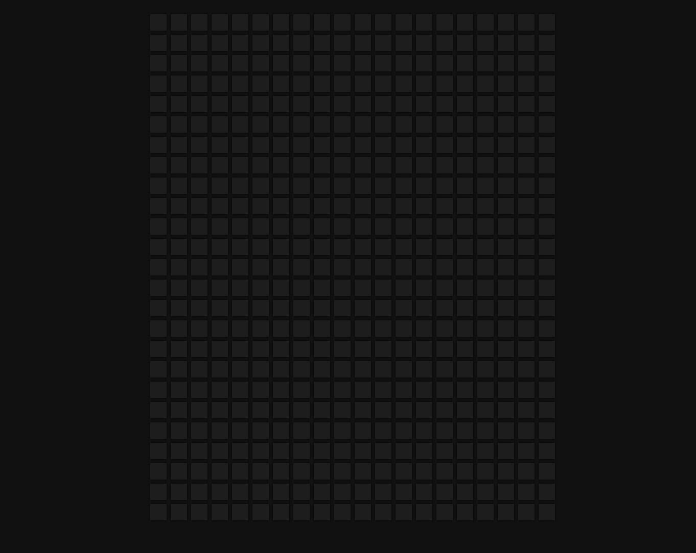

## HoverBoard

> Build a hover board on vanilla js

### [Demo](http://hoverboard-js-ab.surge.sh)
[](https://nimb.ws/cDO2TJ)

### Get started

```shell script
git clone
```
```shell script
open index.html
```
or
```shell script
npm i -g live-server
```
```shell script
live-server
```
